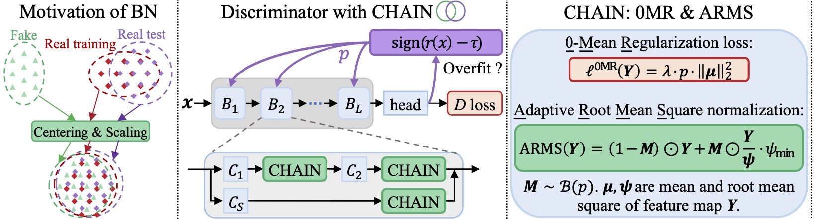

<br />
<p align="center">
    <h1 align="center">
        CHAIN: Enhancing Generalization in Data-Efficient GANs via lipsCHitz continuity constrAIned Normalization (CVPR 2024)
    </h1>

  <p align="center">
    <p align="center">
    <a href="https://scholar.google.com/citations?user=oGD-WMQAAAAJ&hl=en"><strong>Yao Ni </strong></a>
    ,
    <a href="https://users.cecs.anu.edu.au/~koniusz/"><strong>Piotr Koniusz</strong></a>
    </p>
  </p>

  
  <p align="center">
    <a href='https://arxiv.org/abs/2404.00521'>
      
    </a>
    <a href='https://maxwellyaoni.github.io/home/documents/Chain_Slides.pdf'>
      
    </a>
    <a href='https://maxwellyaoni.github.io/home/documents/Chain_Poster.pdf'>
      
    </a>
    <a href='https://www.youtube.com/watch?v=_f7X5_zT_lA'>
      
    </a>
  </p>
  <p align="center">
    
    </p>
</p>
<br/>

## CHAIN acts like a chain, tying distributions closer together for better generalization
 To enhance generalization of Data-Efficient GANs, we can (Lemma 3.1) lower the discrepancy between real and fake data and (Prop. 3.1) reduce the gradient on discriminator weights. BatchNormalization in the discriminator, when applied separately to real and fake batch data, can reduce this discrepancy through centering and scaling. However, these steps can lead to gradient explosion (Theorems 3.1 and 3.2). We address this by replacing the centering step with zero-mean regularization (0MR) and the scaling step with adaptive root mean square normalization (ARMS), forming CHAIN. Theorem 3.3 demonstrates that CHAIN reduces weight and latent feature gradients, promoting generalization and training stability while aiding convergence through lower gradients to the generator. 
 

## Code for [CHAIN-FastGANDBig](https://github.com/MaxwellYaoNi/CHAIN/tree/main/FastGANDBig)

## Code for CHAIN-BigGAN is being reorganized.

## Citation

If you use the theories or code for your research, please cite with the below:
```
@InProceedings{Ni_2024_CVPR,
    author    = {Ni, Yao and Koniusz, Piotr},
    title     = {CHAIN: Enhancing Generalization in Data-Efficient GANs via lipsCHitz continuity constrAIned Normalization},
    booktitle = {Proceedings of the IEEE/CVF Conference on Computer Vision and Pattern Recognition (CVPR)},
    month     = {June},
    year      = {2024},
    pages     = {6763-6774}
}
```
